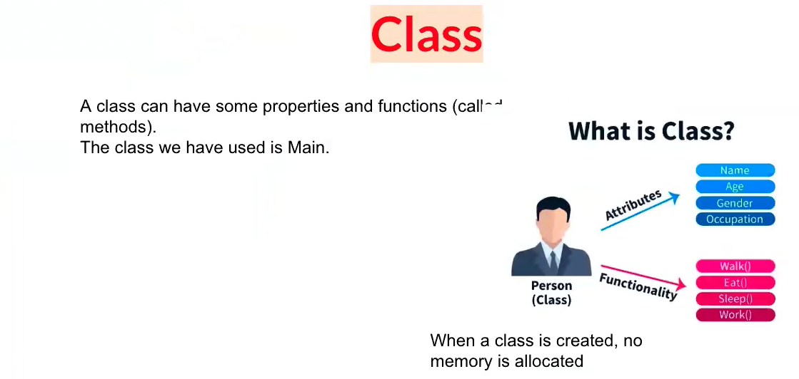
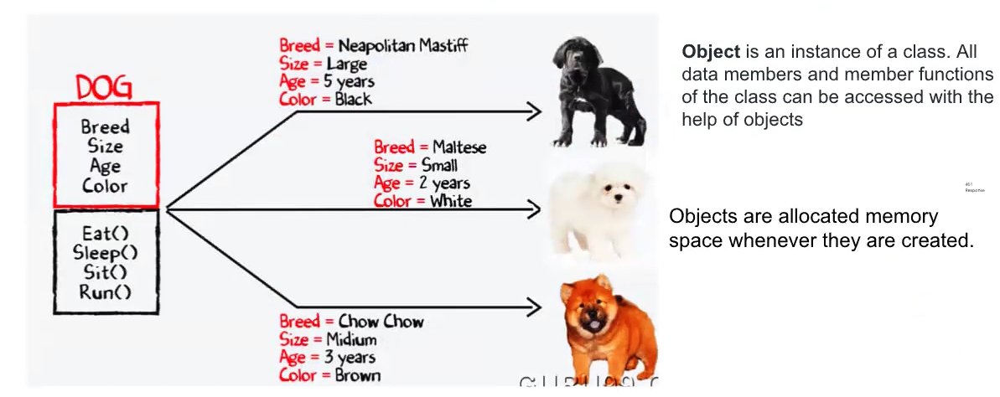
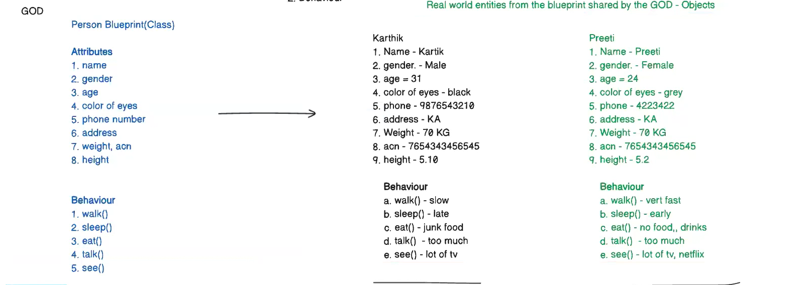
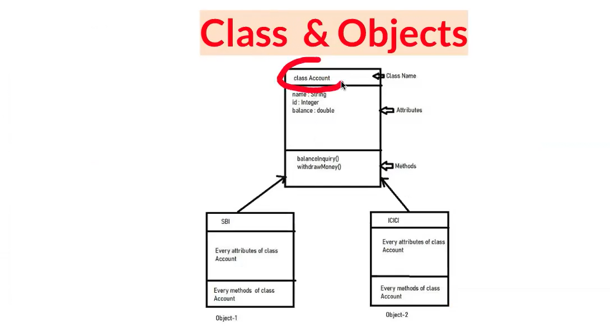
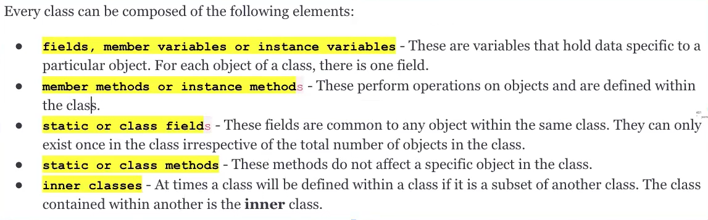

OOPs : Object Oriented Programming
----------------------------------
1. It is a methodology or paradigm to design a program using classes and objects.
2. Something related to object and Classes
3. Divide the program into classes and objects
4. Emphasis on the data
5. Python, Java
6. Productivity is high

Procedural Programming Language(PPL)
-------------------------------
1. Everything that you create a program, you can divide them into functions.
2. Ex: def sum(), sum(3,4)
3. Data members - data variables and functions - Methods -> PPL - Most things are focused on the functions only.
4. It is not that close to the real world.
5. Emphasis is on the doing things.
6. C language is PPL
7. Productivity is low

Class
-----
 **Class** is a user defined data type which defines its properties(attribute) and its method(Behaviour)
Also called as **Attribute**, properties, data variables, **Behavior**, methods(functions), data members

Object
------
**Object** is a real-time entity. It is an instance of class. An object can represent a person, place or any itme.

All data members and member functions of the class can be accessed with the help of objects

# In OOPs two things will be in common i.e Attribute & Behaviour
God : 
Person Blueprint(class)

**Attribute**
1. Name
2. Gender
3. Age
4. Weight
5. Height
6. Color of an eye

**Behaviour**
1. Walk()
2. Sleep()
3. Talk()
4. See()
5. Eat()

By using attributes and behaviour(like a blueprint) God can create a different person but it may vary but blueprint remains same.

**Classes and objects**

Class
-----

# Constructor
1. Special Function in class , _ _init _ _()
2. Called automatically when object is created
3. It has two types

   a. Default - With no argument

   b. Parameterized - With argument
4. Constructor doesn't return anything
5. Name of the constructor is -- init --
6. self - current object, --init-- 
7. Pupose of constructor is to initialize the variables in class.

It will be automatically called when we create a object

1. **Objects**: Imagine your favorite toy, like a toy car. The toy car is an object. 
   It has features like color, size, and shape (these are called attributes). 
   It can also do things like move or honk (these are called methods).
2. **Classes:** Think of a class as a blueprint or a recipe. If you have a recipe for making cookies, 
   you can use it to make many cookies. Similarly, a class is a blueprint for creating objects. 
   For example, a Car class can be used to make many toy cars.
3. **Encapsulation:** This is like a treasure chest. All the important things (attributes and methods) are kept inside 
   the chest, and you can only access them using a key (methods). This keeps everything safe and organized.
4. **Inheritance:** Imagine you have a toy car and a toy truck. Both are vehicles, 
   so they share some features like wheels and the ability to move. 
   Inheritance means the toy truck can inherit features from the toy car, 
   but it can also have its own special features like a bigger size.
5. **Polymorphism:** This is like having different types of pets. You can have a dog, a cat, and a bird. 
   When you say “speak,” each pet makes a different sound. 
   Polymorphism means different objects can respond to the same command in their own unique way.
6. **Abstraction:** Think of a TV remote. You press a button to change the channel, 
   but you don’t need to know how the remote works inside. Abstraction means you only need to know how to use something, 
   not how it works inside.
